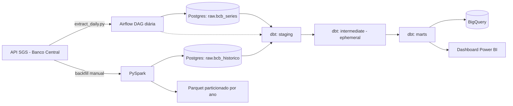
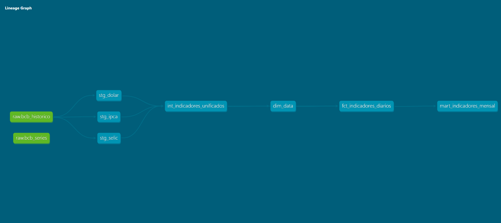
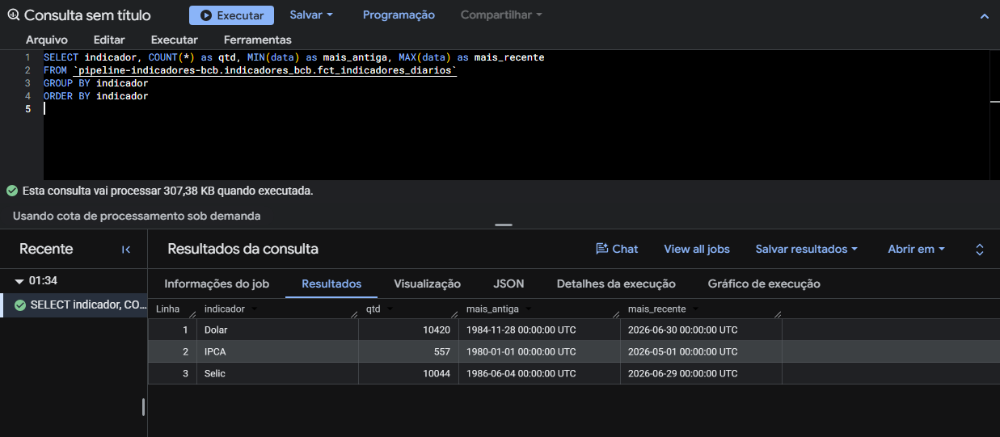
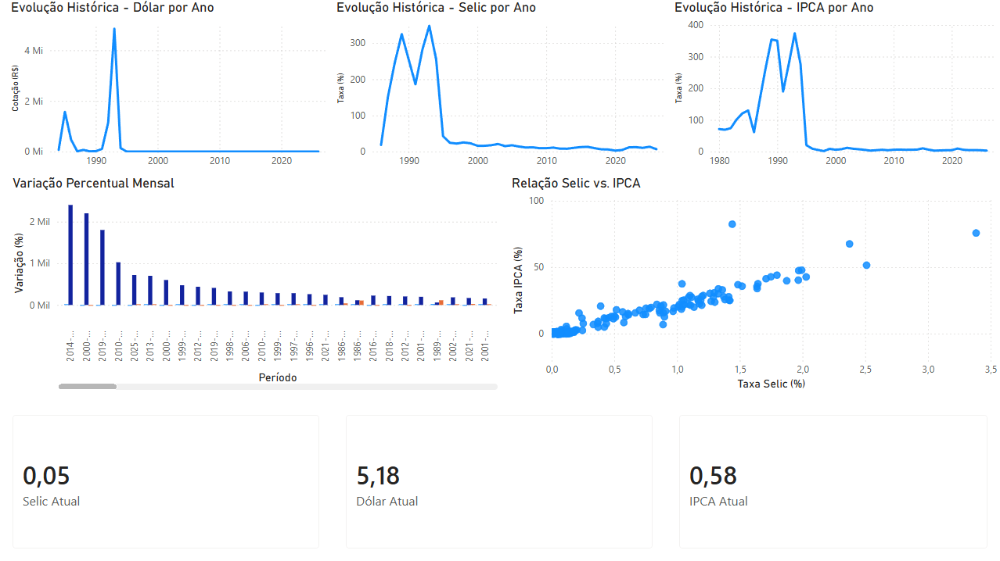
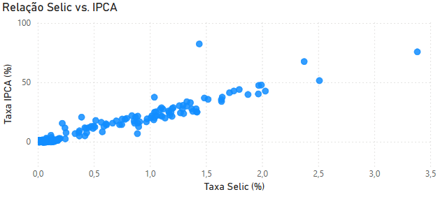

# Pipeline de Indicadores Econômicos — Banco Central do Brasil

> Pipeline de dados batch ponta a ponta para ingestão, processamento e análise de
> indicadores econômicos do BCB (Selic, IPCA, Dólar) com Airflow, PySpark, dbt e BigQuery.

## Sobre o Projeto

Este projeto nasceu como parte do meu processo de aprendizado prático em Engenharia de
Dados, motivado pela busca de uma vaga de estágio na área. Em vez de seguir um
tutorial genérico, escolhi construir um pipeline real, com uma fonte de dados pública
e relevante (indicadores econômicos do Banco Central do Brasil), cobrindo o ciclo
completo que uma vaga júnior de dados normalmente exige: ingestão via API,
orquestração, processamento em escala, modelagem analítica, testes de qualidade e
entrega em cloud com visualização.

A escolha por construir cada camada manualmente — em vez de usar ferramentas
gerenciadas ou wizards — foi intencional: o objetivo não era só ter um pipeline
funcionando, mas entender e conseguir explicar cada decisão de arquitetura por trás
dele. A seção abaixo documenta esse raciocínio.

## Arquitetura

## Decisões Técnicas

**Orquestração com `LocalExecutor`, não `CeleryExecutor`.**
O volume de tasks deste projeto (4 tasks diárias) não justifica workers distribuídos
com Redis. `LocalExecutor` com Postgres como backend de metadados é suficiente, mais
simples de manter, e evita a complexidade operacional de um cluster Celery que não
teria propósito real aqui.

**Um único Postgres servindo dois bancos lógicos.**
`airflow` guarda os metadados internos do Airflow; `pipeline_bcb` guarda os dados do
pipeline em si (schemas `raw`, `staging`, `marts`). Isso evita subir dois containers
de banco só para separar responsabilidades — a separação lógica via schema já é
suficiente neste porte de projeto.

**Duas estratégias de idempotência diferentes, para dois propósitos diferentes.**
A DAG diária faz upsert linha a linha (`INSERT ... ON CONFLICT DO NOTHING`) — ela roda
todo dia e só precisa acrescentar dados novos. O backfill histórico (PySpark) faz
`TRUNCATE + reload` completo — ele roda esporadicamente e sempre deve refletir o
resultado mais atual do cálculo, não um acréscimo. Tratar os dois com a mesma lógica
seria incorreto para pelo menos um dos casos.

**PySpark para demonstrar a API de DataFrame e window functions — não porque o volume
exige processamento distribuído.**
Este é um ponto que assumo abertamente: as séries do BCB somam ~21 mil registros, o
que caberia tranquilamente em memória com pandas puro. O PySpark foi escolhido
deliberadamente para demonstrar competência com a API de DataFrame, partições e window
functions distribuídas — habilidades que aparecem em vagas de engenharia de dados
mesmo quando o volume real do dia a dia não exige um cluster.

**Window functions diferenciadas por frequência de série.**
Selic e Dólar são séries diárias; IPCA é mensal. Uma média móvel de
`rowsBetween(-29, 0)` (30 linhas) representa ~30 dias úteis para as séries diárias,
mas representaria 30 *meses* se aplicada ao IPCA — um erro sutil de semântica, não de
sintaxe, que só aparece se você não conhece o domínio dos dados. Por isso a média
móvel de 30 dias só é calculada para Selic/Dólar; o IPCA recebe apenas variação
percentual mês a mês, que é semanticamente correta independente da frequência da
série.

**Modelagem em camadas com dbt (staging → intermediate → marts).**
Staging materializa como `view` (limpeza/renomeação leve, sem custo de
armazenamento). A camada intermediate é `ephemeral` — existe só como CTE inline
durante a compilação, sem virar objeto físico no banco, porque ninguém deveria
consultar essa camada diretamente. Marts materializa como `table`, já que são o
produto final consumido pelo BI e pela exportação ao BigQuery.

**Testes de qualidade de dados com os testes nativos do dbt.**
16 testes (`not_null`, `unique`, `accepted_values`) nas camadas staging e marts, sem
pacotes externos como `dbt-utils` — suficiente para este porte de projeto e sem
dependência adicional a manter.

**`BashOperator` em vez de `astronomer-cosmos` para integrar dbt ao Airflow.**
`astronomer-cosmos` é a ferramenta "certa" para produção, mas traz uma dependência
pesada para um projeto de portfólio. Um `BashOperator` chamando `dbt run`/`dbt test`
diretamente é mais simples e igualmente válido no contexto deste projeto — uma
decisão consciente de escopo, não uma limitação técnica.

**Ambiente Python isolado para o dbt dentro do container do Airflow.**
`dbt-core` e `apache-airflow-providers-postgres` compartilham dependências
transitivas (Jinja2, click, entre outras) que frequentemente conflitam quando
instaladas no mesmo ambiente. Em vez de forçar uma resolução de versão frágil, o dbt
roda num virtualenv próprio (`/opt/airflow/dbt_venv`) dentro de uma imagem Docker
customizada — o mesmo padrão recomendado por ferramentas como o `astronomer-cosmos`
para esse tipo de conflito.

**BigQuery Sandbox como touchpoint de cloud, com suas limitações assumidas.**
O Sandbox não suporta DML (`UPDATE`/`MERGE`) e expira tabelas após 60 dias de
inatividade. A carga usa `WRITE_TRUNCATE` por design, e os screenshots em
`docs/screenshots/` documentam permanentemente o resultado, já que o dado ao vivo no
BigQuery não é garantido para sempre — uma decisão de custo zero apropriada para um
projeto de portfólio, não para produção.

## Stack

| Camada | Tecnologia |
|---|---|
| Orquestração | Apache Airflow (LocalExecutor) |
| Processamento distribuído | PySpark |
| Transformação | dbt-core |
| Armazenamento local | PostgreSQL |
| Cloud warehouse | BigQuery (GCP Sandbox) |
| Dashboard | Power BI Desktop |
| Containerização | Docker + Docker Compose |
| Versionamento | Git + GitHub |

## Resultados

- **42 anos** de histórico processado (Dólar desde 1984, Selic desde 1986, IPCA desde 1980)
- **21.021 registros** no total: 10.420 (Dólar) + 10.044 (Selic) + 557 (IPCA)
- **3 indicadores** econômicos processados de ponta a ponta
- **16 testes** de qualidade de dados com dbt (todos passando)
- Pipeline diário idempotente — roda N vezes no mesmo dia sem duplicar dados
  (`ON CONFLICT DO NOTHING` na carga diária, `TRUNCATE + reload` no backfill)

## Screenshots

### Lineage do dbt (raw → staging → intermediate → marts)

### Tabelas no BigQuery

### Dashboard — visão geral

### Dashboard — relação Selic × IPCA

## Como rodar localmente

### Pré-requisitos
- Docker Desktop
- Python 3.10+
- Java 17 (necessário para o PySpark)
- Conta Google (gratuita) para o BigQuery Sandbox

### Setup (Windows / PowerShell)

\`\`\`powershell
# 1. Clone o repositório
git clone https://github.com/davidkleinn/pipeline-indicadores-bcb.git
cd pipeline-indicadores-bcb

# 2. Crie o ambiente virtual e instale as dependências
python -m venv .venv
.\.venv\Scripts\Activate.ps1
pip install -r requirements.txt

# 3. Configure as variáveis de ambiente
Copy-Item .env.example .env
# Edite o .env com seus valores (senhas, GCP_PROJECT_ID, etc.)

# 4. Suba a infraestrutura
docker compose up -d
# Aguarde o serviço airflow-init concluir (~1-2 min na primeira vez)

# 5. Acesse a UI do Airflow em localhost:8080

# 6. Execute o backfill histórico (apenas uma vez)
python spark_jobs\backfill_historico.py

# 7. Rode o dbt manualmente para validar (a DAG também roda isso automaticamente)
. .\load_env.ps1
cd dbt\pipeline_bcb
dbt run
dbt test

# 8. Dispare a DAG diária manualmente na UI do Airflow
#    ou aguarde o agendamento @daily
\`\`\`

### Notas específicas de ambiente Windows

Este projeto foi desenvolvido e testado no Windows, e alguns ajustes de ambiente
foram necessários — documentados aqui para quem for reproduzir:

- **PySpark exige `winutils.exe`/`hadoop.dll`** (Hadoop 3.3.6) e a variável
  `HADOOP_HOME` configurada, mesmo rodando 100% local — sem isso, a escrita em
  disco (Parquet) falha com `UnsatisfiedLinkError`.
- **Conexões PostgreSQL usam `127.0.0.1` explícito, não `localhost`** — o Windows
  PT-BR pode resolver `localhost` através do arquivo `hosts` do sistema com
  codificação Windows-1252, o que quebra bibliotecas que esperam UTF-8 (`psycopg2`).
- **A porta do Postgres exposta ao host é `5433`, não a padrão `5432`** (ajustável
  via `POSTGRES_HOST_PORT` no `.env`) — evita conflito com instalações locais de
  Postgres que já ocupam a porta padrão.
- **dbt e Airflow rodam em ambientes Python isolados dentro do container**
  (`/opt/airflow/dbt_venv`), evitando conflito de dependências entre `dbt-core` e
  o `apache-airflow-providers-postgres`.

## Limitações conhecidas

- **Volume de dados:** séries econômicas são naturalmente pequenas (~21 mil
  registros no total). O PySpark foi escolhido para demonstrar a API de DataFrame
  e window functions corretamente — não porque o volume exige processamento
  distribuído. Numa entrevista, essa é a resposta honesta se perguntarem sobre isso.
- **API do BCB:** desde março de 2025 limita consultas a janelas de até 10 anos —
  a paginação automática em `extract/bcb_client.py` (`get_serie_completa`) resolve isso.
- **BigQuery Sandbox:** não suporta DML (`UPDATE`/`MERGE`); a carga usa
  `WRITE_TRUNCATE` (substituição completa) por design. Além disso, **tabelas no
  Sandbox expiram automaticamente após 60 dias** de inatividade — os screenshots em
  `docs/screenshots/` são a evidência permanente do resultado; rode
  `scripts/export_to_bigquery.py` novamente para repopular se necessário.